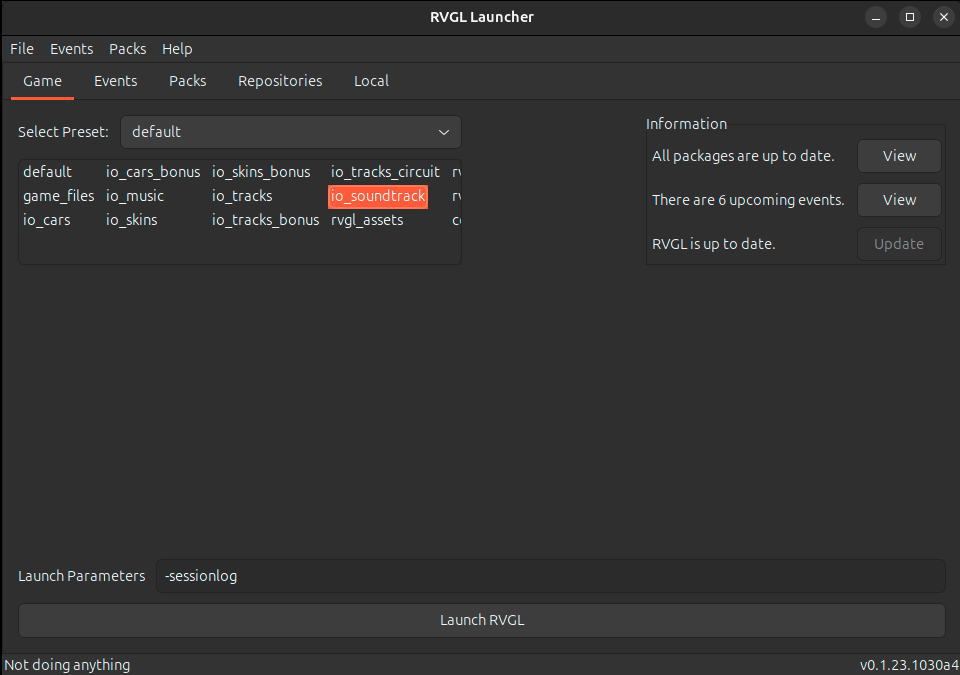

# rvgl-utils [](https://github.com/frantjc/rvgl-utils/actions) [](https://pkg.go.dev/github.com/frantjc/rvgl-utils) [](https://goreportcard.com/report/github.com/frantjc/rvgl-utils)

Tools for tracking scores in [RVGL](https://rvgl.org/) sessions.

## Install

From a [release](https://github.com/frantjc/rvgl-utils/releases).

Using `brew`:

```sh
brew install frantjc/tap/forge
```

Using `go`:

```sh
go install github.com/frantjc/forge/cmd/forge
```

From source:

```sh
git clone https://github.com/frantjc/rvgl-utils
cd rvgl-utils
go install ./cmd/rvglsm
```

## Use

Launch `rvgl` with the `-sessionlog` parameter.



Start or join a multiplayer game in RVGL. This begins a session.

Now, run `rvglsm`:

```sh
rvglsm
```

This will watch for updates to the session from RVGL and write them to the "sink," which is stdout by default. RVGL seems to update the session when a new race is selected after the previous one is finished.

`rvglsm` can write updates to different destinations. As of writing, Discord is the only additional supported sink:

```sh
rvglsm --sink {webhook_url}
```

Where `{webhook_url}` is a Discord webhook URL like `https://discordapp.com/api/webhooks/{webhook_id}/{webhook_token}[/messages/{message_id}]`.

If you use a custom `-prefpath` with `rvgl`, you'll have to tell `rvglsm` about it, too:

```sh
rvglsm --prefpath {-prefpath}
```

For a full list of available flags:

```sh
rvglsm --help
```

```
Usage:
  rvglsm [flags]

Flags:
  -x, --exclude count          Number of races at the beginning of the session to exclude
  -H, --handicap stringToInt   Handicap to apply (default [])
  -h, --help                   Help for rvglsm
      --include-ai             Score AI players
      --laps int               Set NLaps in default profile.ini and exit
      --prefpath string        RVGL -prefpath to search for the session in
      --session string         Name of the session to resolve instead of using the latest one
  -s, --sink string            URL of the sink to send updates to (e.g. a Discord webhook URL)
      --version                Version for rvglsm
```
